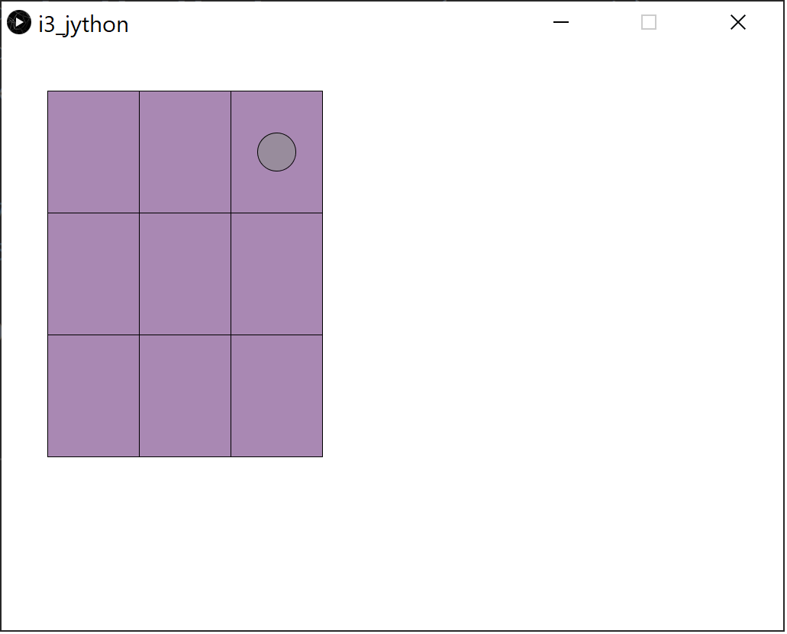

# Tic tac toe board in python

I've used Python 3.8 to create this game. It was not tested in different versions of Python.

## Installation

To run the project first you need to install the processing-py package using pip:
```
pip install processing-py --upgrade
```

## Exercise

1. Create a procedure to draw game board
2. Create a procedure which draws a circle

## Screenshot

